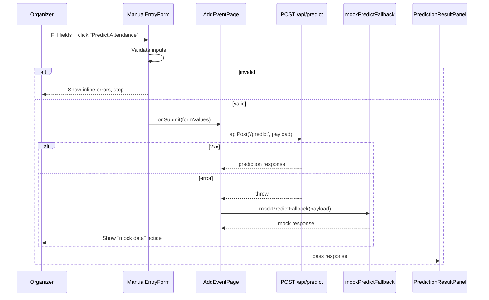
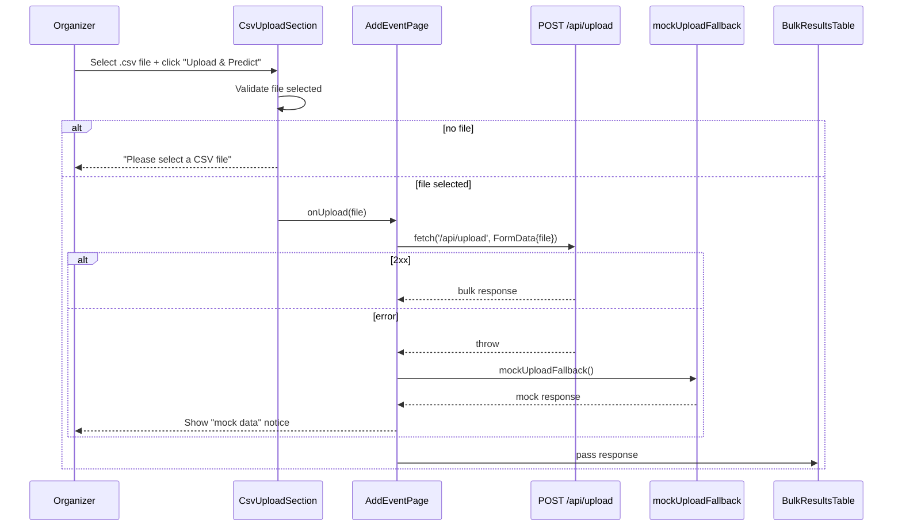

# Design Document: Add Event Page

## Overview

The Add Event page introduces a new route (`/add-event`) that gives organizers two prediction workflows in a single view: a manual single-event form backed by `POST /api/predict`, and a bulk CSV upload backed by `POST /api/upload`. Both workflows degrade gracefully to deterministic mock responses when the backend is unavailable, keeping the demo fully functional without infrastructure.

The page reuses the existing two-column shell (`DashboardSidebar` + `<main>`) established by `OrganizerDashboard`. The only change to existing files is wiring the currently visual-only "Add Event (Manual)" sidebar item to navigate to `/add-event` and registering the new route in `App.jsx`.

---

## Architecture

```
App.jsx
└── ProtectedRoute
    └── /add-event → AddEventPage
            ├── DashboardSidebar (modified: "Add Event (Manual)" now navigates)
            └── <main>
                ├── ManualEntryForm
                │   └── PredictionResultPanel (conditional)
                └── CsvUploadSection
                    └── BulkResultsTable (conditional)
```

Data flow for manual entry:



Data flow for CSV upload:



---

## Components and Interfaces

### `AddEventPage` (`client/src/pages/AddEventPage.jsx`)

Top-level page component. Owns all async state and orchestrates child components.

**State:**

| State variable | Type | Description |
|---|---|---|
| `prediction` | `object \| null` | Response from Predict_API or mock; null until first submission |
| `predictLoading` | `boolean` | True while Predict_API call is in flight |
| `predictMock` | `boolean` | True when prediction result came from mock fallback |
| `bulkResult` | `object \| null` | Response from Upload_API or mock; null until first upload |
| `uploadLoading` | `boolean` | True while Upload_API call is in flight |
| `uploadMock` | `boolean` | True when bulk result came from mock fallback |

**Key handlers:**

```js
async function handlePredict(formValues) { ... }   // calls apiPost, falls back to mock
async function handleUpload(file) { ... }           // calls fetch multipart, falls back to mock
function handleLogout() { ... }                     // same pattern as OrganizerDashboard
```

**Props passed down:**

- `ManualEntryForm`: `onSubmit={handlePredict}`, `loading={predictLoading}`
- `PredictionResultPanel`: `data={prediction}`, `isMock={predictMock}`
- `CsvUploadSection`: `onUpload={handleUpload}`, `loading={uploadLoading}`
- `BulkResultsTable`: `data={bulkResult}`, `isMock={uploadMock}`
- `DashboardSidebar`: `onLogout={handleLogout}`, `activePath="/add-event"`

---

### `ManualEntryForm` (`client/src/components/ManualEntryForm.jsx`)

Controlled form component. Manages its own field state and validation errors. Calls `props.onSubmit` only when all fields pass validation.

**Fields:**

| Field | Input type | Required | Validation |
|---|---|---|---|
| `title` | text | yes | non-empty |
| `date` | date | yes | non-empty |
| `time` | time | yes | non-empty |
| `location` | text | yes | non-empty |
| `category` | select | yes | one of the five valid options |
| `expectedRsvp` | number | yes | integer ≥ 1 |
| `costPerPerson` | number | yes | number ≥ 0 |
| `plannedQuantity` | number | yes | integer ≥ 1 |

**Planned quantity sync logic:**

`plannedQuantity` is initialised to `""`. A boolean ref `userEditedQty` tracks whether the user has manually changed the planned quantity field. When `expectedRsvp` changes and `userEditedQty` is `false`, `plannedQuantity` is updated to match `expectedRsvp`. Once the user edits `plannedQuantity` directly, `userEditedQty` is set to `true` and the sync stops.

**Payload mapping to Predict_API:**

```js
{
  event_type:        formValues.category,
  expected_signups:  Number(formValues.expectedRsvp),
  planned_quantity:  Number(formValues.plannedQuantity),
  cost_per_person:   Number(formValues.costPerPerson),
}
```

**Props:**

| Prop | Type | Description |
|---|---|---|
| `onSubmit` | `(payload) => void` | Called with mapped payload on valid submission |
| `loading` | `boolean` | Disables submit button and shows spinner when true |

---

### `PredictionResultPanel` (`client/src/components/PredictionResultPanel.jsx`)

Pure display component. Renders nothing when `data` is null.

**Props:**

| Prop | Type | Description |
|---|---|---|
| `data` | `object \| null` | Prediction response object |
| `isMock` | `boolean` | When true, renders a yellow "mock data" notice banner |

**Displayed fields from `data`:**

- `predicted_attendance`
- `planned_quantity`
- `food_waste_lbs`
- `total_savings_usd`
- `factors[]` — each rendered as `{ label, impact, detail }`

---

### `CsvUploadSection` (`client/src/components/CsvUploadSection.jsx`)

Manages file selection state and validation. Calls `props.onUpload(file)` on valid submission.

**Props:**

| Prop | Type | Description |
|---|---|---|
| `onUpload` | `(file: File) => void` | Called with the selected File on valid submission |
| `loading` | `boolean` | Disables button and shows spinner when true |

**Validation:** If no file is selected when the button is clicked, renders "Please select a CSV file" inline. The file input has `accept=".csv"`.

---

### `BulkResultsTable` (`client/src/components/BulkResultsTable.jsx`)

Pure display component. Renders nothing when `data` is null.

**Props:**

| Prop | Type | Description |
|---|---|---|
| `data` | `object \| null` | Upload response `{ events, summary }` |
| `isMock` | `boolean` | When true, renders a yellow "mock data" notice banner |

**Table columns (one row per `events[]` entry):**

- Event name (`event_name`)
- Predicted attendance (`predicted_attendance`)
- Estimated savings (`total_savings_usd`)
- Status (`status`)

**Summary row** (from `summary`):

- Total savings USD (`total_savings_usd`)
- Total CO2 saved kg (`total_co2_saved_kg`)
- Total food waste lbs (`total_food_waste_lbs`)

---

### `DashboardSidebar` (modified — `client/src/components/DashboardSidebar.jsx`)

The only change: the "Add Event (Manual)" nav item gains an `onClick` that calls `useNavigate()` to push `/add-event`. The item becomes a real link rather than a visual-only `div`. The `activePath` prop already handles highlighting.

No other changes to `DashboardSidebar`.

---

### Mock Fallback Functions (`client/src/utils/mockFallbacks.js`)

Two pure functions, no side effects, no imports from React.

#### `mockPredictFallback(payload)`

Accepts the same shape as the Predict_API request body. Returns a deterministic response derived from `payload.expected_signups` and `payload.event_type`.

```js
// Determinism: show rate is looked up from a fixed table keyed by event_type
const SHOW_RATES = {
  food_social:        0.72,
  academic_workshop:  0.65,
  career_fair:        0.58,
  club_meeting:       0.80,
  general:            0.68,
}

export function mockPredictFallback(payload) {
  const rate = SHOW_RATES[payload.event_type] ?? 0.68
  const predicted = Math.round(payload.expected_signups * rate)
  const waste = Math.max(0, payload.planned_quantity - predicted) * 0.5
  const savings = waste * (payload.cost_per_person ?? 10)
  return {
    predicted_attendance: predicted,
    confidence_low:       Math.round(predicted * 0.85),
    confidence_high:      Math.round(predicted * 1.15),
    confidence_level:     'medium',
    show_rate_pct:        Math.round(rate * 100),
    expected_signups:     payload.expected_signups,
    planned_quantity:     payload.planned_quantity,
    food_waste_lbs:       parseFloat(waste.toFixed(1)),
    total_savings_usd:    parseFloat(savings.toFixed(2)),
    factors: [
      { label: 'Event Type',    impact: 'medium', detail: `${payload.event_type} events average ${Math.round(rate * 100)}% show rate` },
      { label: 'Registration',  impact: 'low',    detail: 'No registration timing data available; using baseline' },
    ],
  }
}
```

#### `mockUploadFallback()`

Returns a static but realistic bulk response. No inputs needed.

```js
export function mockUploadFallback() {
  return {
    events: [
      { row: 1, event_name: 'Spring Mixer',       event_type: 'food_social',       expected_signups: 80,  predicted_attendance: 58, show_rate_pct: 72, confidence_level: 'medium', over_prepared_by: 22, total_savings_usd: 110.00, food_waste_lbs: 11.0, co2_saved_kg: 4.9, status: 'ok' },
      { row: 2, event_name: 'Resume Workshop',     event_type: 'academic_workshop', expected_signups: 40,  predicted_attendance: 26, show_rate_pct: 65, confidence_level: 'low',    over_prepared_by: 14, total_savings_usd: 70.00,  food_waste_lbs: 7.0,  co2_saved_kg: 3.1, status: 'ok' },
      { row: 3, event_name: 'Career Fair',         event_type: 'career_fair',       expected_signups: 200, predicted_attendance: 116, show_rate_pct: 58, confidence_level: 'high',   over_prepared_by: 84, total_savings_usd: 420.00, food_waste_lbs: 42.0, co2_saved_kg: 18.7, status: 'ok' },
    ],
    summary: {
      total_events:        3,
      processed:           3,
      blocked:             0,
      total_savings_usd:   600.00,
      total_co2_saved_kg:  26.7,
      total_food_waste_lbs: 60.0,
    },
  }
}
```

---

## Data Models

### Predict_API Request Payload

```js
{
  event_type:        string,   // one of: food_social | academic_workshop | career_fair | club_meeting | general
  expected_signups:  number,   // integer >= 1
  planned_quantity:  number,   // integer >= 1
  cost_per_person:   number,   // float >= 0
  // optional fields (not sent by manual form, included if available):
  time_slot?:              string,
  registration_timing?:    string,
  interest_match_score?:   number,
  historical_show_rate?:   number,
}
```

### Predict_API Response

```js
{
  predicted_attendance: number,
  confidence_low:       number,
  confidence_high:      number,
  confidence_level:     string,
  show_rate_pct:        number,
  expected_signups:     number,
  planned_quantity:     number,
  factors:              Array<{ label: string, impact: string, detail: string }>,
  food_waste_lbs:       number,
  total_savings_usd:    number,
  // additional fields present but not displayed in MVP:
  data_source, over_prepared_by, direct_savings_usd, food_waste_cost_usd,
  co2_saved_kg, hidden_costs, semester_projection, breakdown
}
```

### Upload_API Response

```js
{
  events: Array<{
    row:                  number,
    event_name:           string,
    event_type:           string,
    expected_signups:     number,
    predicted_attendance: number,
    show_rate_pct:        number,
    confidence_level:     string,
    over_prepared_by:     number,
    total_savings_usd:    number,
    food_waste_lbs:       number,
    co2_saved_kg:         number,
    status:               string,
  }>,
  summary: {
    total_events:         number,
    processed:            number,
    blocked:              number,
    total_savings_usd:    number,
    total_co2_saved_kg:   number,
    total_food_waste_lbs: number,
  }
}
```

### Form State (internal to `ManualEntryForm`)

```js
{
  title:           string,
  date:            string,   // YYYY-MM-DD
  time:            string,   // HH:MM
  location:        string,
  category:        string,   // one of the five valid options
  expectedRsvp:    string,   // controlled as string, parsed to number on submit
  costPerPerson:   string,
  plannedQuantity: string,
}
```

---

## Correctness Properties

*A property is a characteristic or behavior that should hold true across all valid executions of a system — essentially, a formal statement about what the system should do. Properties serve as the bridge between human-readable specifications and machine-verifiable correctness guarantees.*

### Property 1: Invalid form inputs are always rejected

*For any* combination of form field values where at least one required field is empty or a numeric field violates its minimum constraint, submitting the form SHALL not invoke the prediction API and SHALL produce at least one inline validation error message.

**Validates: Requirements 3.1, 3.2, 3.3**

---

### Property 2: Valid form inputs always produce a correctly shaped API payload

*For any* set of valid form field values (non-empty strings, `expectedRsvp >= 1`, `costPerPerson >= 0`, `plannedQuantity >= 1`), submitting the form SHALL invoke the prediction API with a payload where `event_type` equals the selected category, `expected_signups` equals the numeric RSVP value, `planned_quantity` equals the numeric planned quantity value, and `cost_per_person` equals the numeric cost value.

**Validates: Requirements 3.4, 4.1**

---

### Property 3: Planned quantity tracks RSVP count until manually overridden

*For any* positive integer value entered into the expected RSVP count field, if the organizer has not manually edited the planned quantity field, the planned quantity field SHALL display the same value as the expected RSVP count field.

**Validates: Requirements 2.9**

---

### Property 4: Prediction result panel renders all required fields for any valid response

*For any* valid prediction response object (containing `predicted_attendance`, `planned_quantity`, `food_waste_lbs`, `total_savings_usd`, and a non-empty `factors` array), the `PredictionResultPanel` SHALL render each of those values and each factor's `label`, `impact`, and `detail` in the output.

**Validates: Requirements 5.1, 5.2, 5.3, 5.4, 5.5**

---

### Property 5: Manual mock fallback always returns a complete, deterministic response

*For any* valid Predict_API request payload, `mockPredictFallback` SHALL return an object containing all required fields (`predicted_attendance`, `confidence_low`, `confidence_high`, `confidence_level`, `show_rate_pct`, `expected_signups`, `factors`, `food_waste_lbs`, `total_savings_usd`, `planned_quantity`), the `factors` array SHALL have at least two entries each with non-empty `label`, `impact`, and `detail`, and calling the function twice with the same `(expected_signups, event_type)` SHALL produce the same `predicted_attendance` both times.

**Validates: Requirements 6.1, 6.2, 6.3**

---

### Property 6: CSV upload always sends the file under the correct field name

*For any* File object with a `.csv` extension, the upload handler SHALL construct a `FormData` body where the file is stored under the key `"file"` and SHALL include the `Authorization` header from `sessionStorage`.

**Validates: Requirements 7.4, 10.5**

---

### Property 7: Bulk results table renders correct rows and summary for any bulk response

*For any* Upload_API response with an `events` array of length N and a `summary` object, `BulkResultsTable` SHALL render exactly N data rows each containing `event_name`, `predicted_attendance`, `total_savings_usd`, and `status`, and SHALL render one summary row containing `total_savings_usd`, `total_co2_saved_kg`, and `total_food_waste_lbs` from the `summary` object.

**Validates: Requirements 8.1, 8.2**

---

### Property 8: CSV mock fallback always returns a complete response

*For any* invocation of `mockUploadFallback`, the returned object SHALL contain an `events` array with at least three entries each having non-null `event_name`, `predicted_attendance`, `total_savings_usd`, and `status`, and a `summary` object with non-null `total_savings_usd`, `total_co2_saved_kg`, and `total_food_waste_lbs`.

**Validates: Requirements 9.1, 9.2**

---

## Error Handling

### Predict_API failure

`handlePredict` wraps `apiPost` in a try/catch. On any thrown error (network failure or non-2xx — `apiPost` throws on non-ok responses):

1. Call `mockPredictFallback(payload)` to get a mock response.
2. Set `prediction` state to the mock response.
3. Set `predictMock = true` to trigger the yellow notice banner in `PredictionResultPanel`.

The `apiPost` wrapper in `client.js` already dispatches an `api-error` event for 500s (handled by `ErrorToast`). The mock fallback notice is a separate, inline, non-blocking UI element.

### Upload_API failure

`handleUpload` wraps the native `fetch` call in a try/catch. On any thrown error or non-2xx response:

1. Call `mockUploadFallback()`.
2. Set `bulkResult` state to the mock response.
3. Set `uploadMock = true` to trigger the yellow notice banner in `BulkResultsTable`.

### Form validation errors

Validation runs synchronously in `ManualEntryForm` before calling `onSubmit`. Errors are stored in a `errors` state object keyed by field name. No API call is made when `errors` is non-empty.

### Loading states

Both `predictLoading` and `uploadLoading` disable their respective submit buttons and show a spinner to prevent duplicate submissions.

---

## Testing Strategy

### Unit / Example-Based Tests

Use Vitest + React Testing Library. Cover all structural and specific-behavior acceptance criteria:

**`AddEventPage`**
- Renders `DashboardSidebar` and both section labels ("Manual Entry", "CSV Upload")
- `DashboardSidebar` receives `activePath="/add-event"`
- `PredictionResultPanel` is not visible on initial render
- `BulkResultsTable` is not visible on initial render
- On successful predict call, `PredictionResultPanel` becomes visible
- On failed predict call, mock notice banner is shown
- On successful upload call, `BulkResultsTable` becomes visible
- On failed upload call, mock notice banner is shown

**`ManualEntryForm`**
- Renders all 8 fields and the submit button
- Clicking submit with empty fields shows validation errors and does not call `onSubmit`
- `expectedRsvp < 1` shows "Must be at least 1"
- `costPerPerson < 0` shows "Cannot be negative"
- Loading state disables submit button

**`PredictionResultPanel`**
- Returns null when `data` is null
- Renders mock notice when `isMock=true`

**`CsvUploadSection`**
- File input has `accept=".csv"`
- Clicking "Upload & Predict" with no file shows "Please select a CSV file"
- Loading state disables button

**`BulkResultsTable`**
- Returns null when `data` is null
- Renders mock notice when `isMock=true`

**`DashboardSidebar`**
- "Add Event (Manual)" navigates to `/add-event` when clicked
- `activePath="/dashboard"` still highlights "Dashboard" and not "Add Event (Manual)" (non-regression)
- `activePath="/add-event"` highlights "Add Event (Manual)"

**Route**
- `/add-event` redirects to `/login` when unauthenticated
- `/add-event` renders `AddEventPage` when authenticated

### Property-Based Tests

Use [fast-check](https://github.com/dubzzz/fast-check) with a minimum of **100 iterations** per property.

**Property 1: Invalid form inputs are always rejected**
- Generator: arbitrary form state objects with at least one required field set to `""` or a numeric field set below its minimum
- Assertion: `onSubmit` is never called; at least one error message is present in the DOM
- Tag: `Feature: add-event-page, Property 1: invalid form inputs are always rejected`

**Property 2: Valid form inputs always produce a correctly shaped API payload**
- Generator: arbitrary valid form states (non-empty strings, `expectedRsvp` in `[1, 1000]`, `costPerPerson` in `[0, 500]`, `plannedQuantity` in `[1, 1000]`, `category` from the five valid options)
- Assertion: `onSubmit` is called with payload where `event_type`, `expected_signups`, `planned_quantity`, `cost_per_person` match the form values
- Tag: `Feature: add-event-page, Property 2: valid form inputs always produce a correctly shaped API payload`

**Property 3: Planned quantity tracks RSVP count until manually overridden**
- Generator: arbitrary positive integers for `expectedRsvp`
- Assertion: after setting `expectedRsvp` without touching `plannedQuantity`, the `plannedQuantity` field value equals `expectedRsvp`
- Tag: `Feature: add-event-page, Property 3: planned quantity tracks RSVP count until manually overridden`

**Property 4: Prediction result panel renders all required fields for any valid response**
- Generator: arbitrary prediction response objects with valid numeric fields and a `factors` array of 1–5 entries
- Assertion: rendered output contains the string representations of `predicted_attendance`, `food_waste_lbs`, `total_savings_usd`, and each factor's `label`
- Tag: `Feature: add-event-page, Property 4: prediction result panel renders all required fields for any valid response`

**Property 5: Manual mock fallback always returns a complete, deterministic response**
- Generator: arbitrary `{ expected_signups: integer(1, 500), event_type: oneof(five options), planned_quantity: integer(1, 500), cost_per_person: float(0, 100) }` objects
- Assertion: result contains all required fields; `factors.length >= 2`; each factor has non-empty `label`, `impact`, `detail`; calling twice with same inputs returns same `predicted_attendance`
- Tag: `Feature: add-event-page, Property 5: manual mock fallback always returns a complete deterministic response`

**Property 6: CSV upload always sends the file under the correct field name**
- Generator: mock `File` objects with `.csv` names and arbitrary string content
- Assertion: the `FormData` passed to `fetch` contains a `"file"` entry matching the input file; the `Authorization` header is present
- Tag: `Feature: add-event-page, Property 6: CSV upload always sends the file under the correct field name`

**Property 7: Bulk results table renders correct rows and summary for any bulk response**
- Generator: arbitrary `{ events: array(1, 20, eventObject), summary: summaryObject }` where each event has the required fields
- Assertion: rendered table has exactly `events.length` data rows; each row contains the event's `event_name`; summary row contains the summary's `total_savings_usd`
- Tag: `Feature: add-event-page, Property 7: bulk results table renders correct rows and summary for any bulk response`

**Property 8: CSV mock fallback always returns a complete response**
- Generator: none (pure function, no inputs)
- Assertion: `events.length >= 3`; each event has non-null `event_name`, `predicted_attendance`, `total_savings_usd`, `status`; `summary` has non-null `total_savings_usd`, `total_co2_saved_kg`, `total_food_waste_lbs`
- Tag: `Feature: add-event-page, Property 8: CSV mock fallback always returns a complete response`
