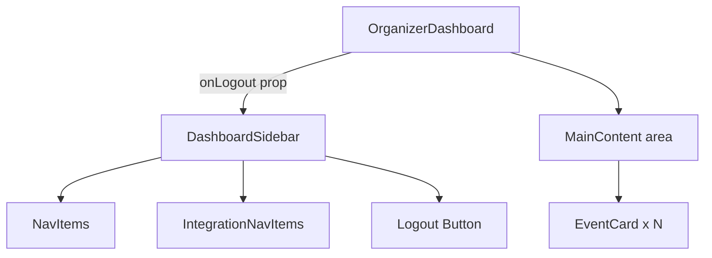

# Design Document: Organizer Dashboard Sidebar

## Overview

This refactor replaces the current `OrganizerDashboard` single-column layout (with a right-side `IntegrationSidebar`) with a two-column layout. A new `DashboardSidebar` component occupies the left column at a fixed 240px width and provides app branding, primary navigation, an integrations sub-section with status badges, and a logout action. The right column (`MainContent`) retains all existing event card rendering logic unchanged.

The change is purely structural — no API calls, data mapping functions, or business logic are modified. The existing `IntegrationSidebar` component is removed from the layout (the file is preserved but no longer imported by `OrganizerDashboard`).

---

## Architecture

The refactored page follows a two-panel shell pattern:

```
OrganizerDashboard (page)
├── DashboardSidebar (new component, left column)
│   ├── Branding ("EventWise")
│   ├── NavItems (Dashboard, Events, Add Event (Manual))
│   ├── Integrations section
│   │   ├── IntegrationNavItem (Handshake + StatusBadge)
│   │   ├── IntegrationNavItem (Meetup + StatusBadge)
│   │   └── IntegrationNavItem (ASU Portal + StatusBadge)
│   └── Bottom actions (Logout button)
└── MainContent (right column, inline in OrganizerDashboard)
    ├── Loading skeleton grid
    ├── Error state
    └── EventCard grid
```

The `handleLogout` function currently defined in `OrganizerDashboard` is passed down to `DashboardSidebar` as a prop, keeping all session/navigation logic in the page component.



---

## Components and Interfaces

### `DashboardSidebar` (new — `client/src/components/DashboardSidebar.jsx`)

**Props:**

| Prop | Type | Description |
|------|------|-------------|
| `onLogout` | `() => void` | Called when the user clicks the Logout button. Defined in `OrganizerDashboard`. |
| `activePath` | `string` | Current route path (e.g. `"/dashboard"`) used to highlight the active NavItem. |

**Internal structure:**

- Top section: "EventWise" branding text
- Middle section: vertical nav list
  - "Dashboard" — active when `activePath === "/dashboard"`
  - "Events" — inactive (no route yet)
  - "Add Event (Manual)" — visual only, no `onClick`, no routing
  - "Integrations" section label
  - Three `IntegrationNavItem` entries (static data, defined inline)
- Bottom section: "Logout" `Button` (ghost/outline variant, calls `onLogout`)

**Static integration data (defined in component file):**

```js
const INTEGRATIONS = [
  { name: 'Handshake',  status: 'Coming soon' },
  { name: 'Meetup',     status: 'In planning' },
  { name: 'ASU Portal', status: 'Coming soon' },
]
```

**StatusBadge color mapping:**

| Status | Tailwind classes |
|--------|-----------------|
| `Coming soon` | `bg-amber-100 text-amber-700 border-amber-200` |
| `In planning` | `bg-blue-100 text-blue-700 border-blue-200` |

### `OrganizerDashboard` (modified — `client/src/pages/OrganizerDashboard.jsx`)

Changes:
- Remove `IntegrationSidebar` import and usage
- Add `DashboardSidebar` import
- Replace the outer `<div className="relative min-h-screen p-6" ...>` background-image wrapper with a plain `min-h-screen flex` two-column shell
- Pass `handleLogout` and `activePath` (from `useLocation` or hardcoded `"/dashboard"`) to `DashboardSidebar`
- The main content area becomes `<main className="flex-1 p-6 overflow-y-auto">`

No changes to: `handleLogout` logic, `useEffect`/`apiGet` call, `mapEventSummary`, `mapWasteInsight`, `items`/`loading`/`error` state, or `EventCard` usage.

---

## Data Models

No new data models are introduced. All state (`items`, `loading`, `error`) remains in `OrganizerDashboard` unchanged.

The sidebar's integration list is static configuration — a plain JS array defined at module scope in `DashboardSidebar.jsx`. No props, no API calls, no state.

```ts
// Conceptual shape (not TypeScript — project uses JSX)
type IntegrationEntry = {
  name: string      // Display label
  status: string    // Badge label: "Coming soon" | "In planning"
}
```

---

## Correctness Properties

*A property is a characteristic or behavior that should hold true across all valid executions of a system — essentially, a formal statement about what the system should do. Properties serve as the bridge between human-readable specifications and machine-verifiable correctness guarantees.*

Most acceptance criteria in this feature are structural UI checks (specific text, specific CSS classes, specific DOM ordering) that are best validated with concrete example-based tests. Two criteria are genuinely universal and benefit from property-based testing:

- **4.2**: Every integration nav item must have a status badge — this is a "for all items" invariant.
- **7.1**: Every event summary must produce a rendered EventCard — this is a round-trip/coverage invariant.

After property reflection, these two are distinct and non-redundant: one tests the sidebar's static rendering invariant, the other tests the main content's data-driven rendering invariant.

### Property 1: Every integration item has a status badge

*For any* list of integration entries rendered by `DashboardSidebar`, each entry in the list must have a corresponding `StatusBadge` element present in the rendered output.

**Validates: Requirements 4.2**

### Property 2: Every event summary produces an EventCard

*For any* non-empty array of event summaries returned by the API and stored in `items`, each summary must produce exactly one `EventCard` in the rendered main content area.

**Validates: Requirements 7.1**

---

## Error Handling

No new error states are introduced. The existing error handling in `OrganizerDashboard` is preserved:

- **Loading state**: skeleton grid shown while `loading === true`
- **API error**: red alert box shown when `error` is non-null
- **Logout failure**: `apiPost('/auth/logout')` failure is silently swallowed (`.catch(() => {})`) — session is cleared and navigation proceeds regardless. This existing behavior is preserved.

The `DashboardSidebar` itself has no async operations and therefore no error states.

---

## Testing Strategy

This feature is a layout refactor with static UI. The vast majority of acceptance criteria are structural checks (text content, CSS classes, DOM ordering, responsive visibility). PBT applies narrowly to the two universal invariants identified above.

### Unit / Example-Based Tests

Cover all structural acceptance criteria with concrete render tests (e.g., Vitest + React Testing Library):

- `DashboardSidebar` renders "EventWise" branding
- `DashboardSidebar` renders all three primary nav items in correct order
- `DashboardSidebar` renders "Add Event (Manual)" with no `onClick` attribute
- `DashboardSidebar` highlights "Dashboard" as active when `activePath="/dashboard"`
- `DashboardSidebar` renders all three integration items with correct names and badge labels
- `DashboardSidebar` renders "Logout" button; clicking it calls `onLogout`
- `OrganizerDashboard` does not render `IntegrationSidebar`
- `OrganizerDashboard` renders loading skeletons when `loading=true`
- `OrganizerDashboard` renders error message when `error` is set
- `OrganizerDashboard` renders event count when loaded

### Property-Based Tests

Use [fast-check](https://github.com/dubzzz/fast-check) (already available in the JS ecosystem) with a minimum of **100 iterations** per property.

**Property 1: Every integration item has a status badge**
- Generator: arbitrary array of `{ name: string, status: string }` objects
- Assertion: rendered output contains one `StatusBadge` per item
- Tag: `Feature: organizer-dashboard-sidebar, Property 1: every integration item has a status badge`

**Property 2: Every event summary produces an EventCard**
- Generator: arbitrary non-empty array of valid event summary objects (with required fields: `id`, `name`, `date`, `predicted_count`, `likelihood`, `risk_factors`, `signup_trend`, `signup_count`)
- Assertion: rendered `OrganizerDashboard` (with mocked API) contains exactly `items.length` `EventCard` instances
- Tag: `Feature: organizer-dashboard-sidebar, Property 2: every event summary produces an EventCard`

### Responsive Behavior

Responsive sidebar collapse (`hidden lg:flex`) is a CSS/Tailwind concern and is verified by asserting the correct responsive utility classes are present on the sidebar element — not by simulating viewport resizes.
